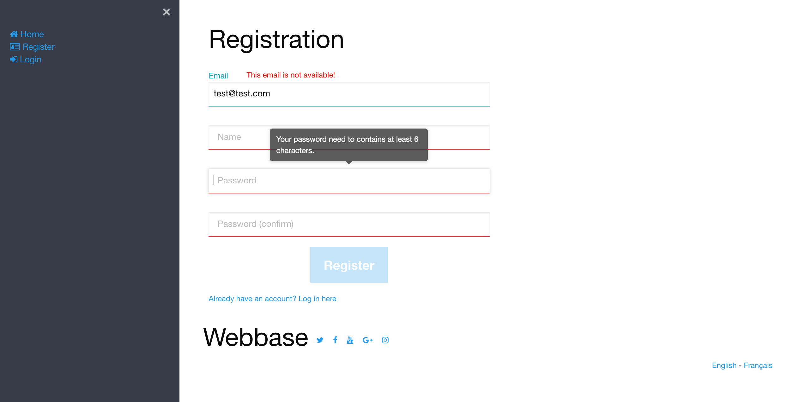
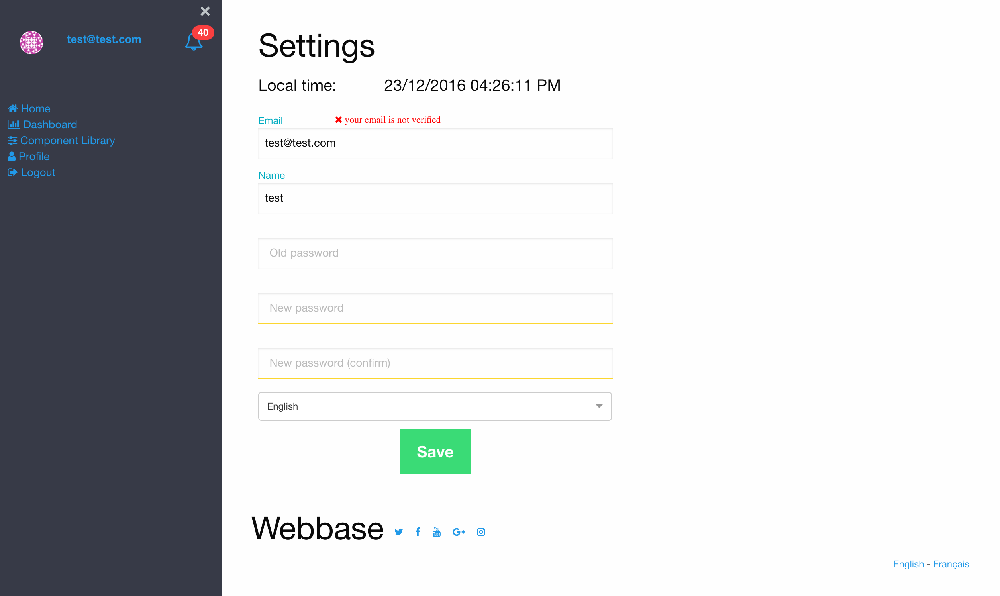
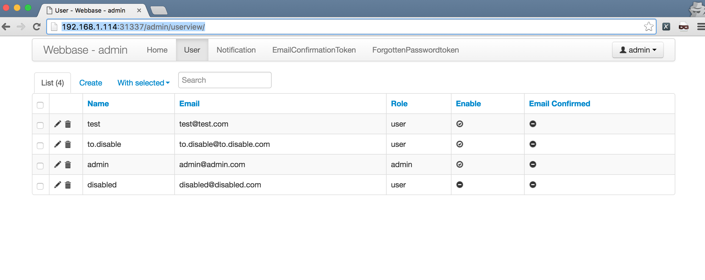
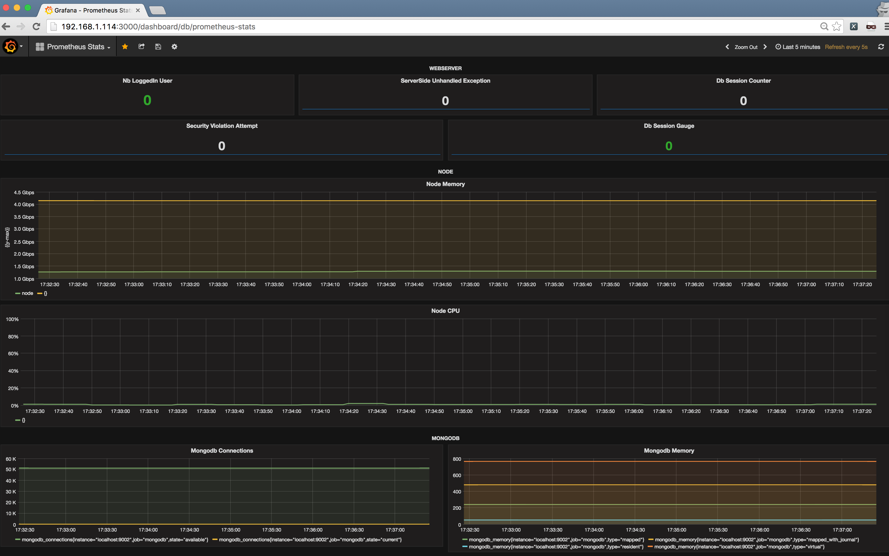
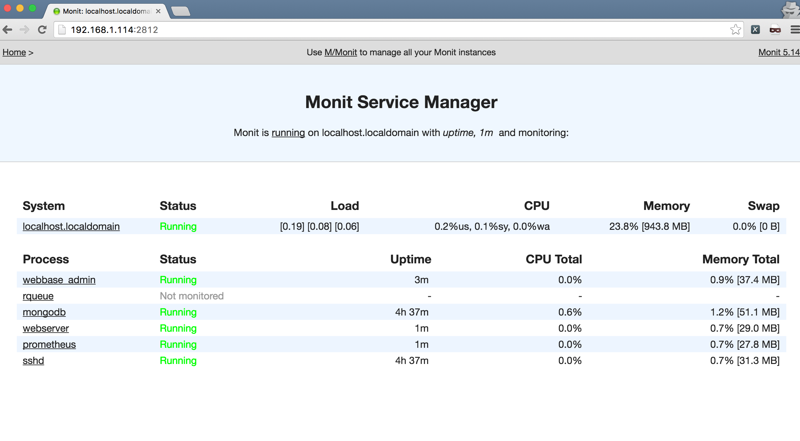

[](https://travis-ci.org/jf-parent/webbase)
[](https://www.python.org/downloads/release/python-350/)
[](https://opensource.org/licenses/MIT)

# Webbase Front-End



# Webbase Front-End Cordova ios


# Webbase Admin


# Grafana


# Monit


# Installation

```bash
$ pip install cookiecutter
$ cookiecutter .
```

# [Documentation](./{{cookiecutter.project_name}}/documentation)

# Version

* 0.0.3 - 2016-12-28 - New features & bug fixes
* 0.0.2 - 2016-10-14 - New features & bug fixes
* 0.0.1 - 2016-06-28 - Initial Release

# New in 0.0.3

## Added
- Cookiecutter configuration
- Foundation 6 sass
- Mongo Migration System
- Cordova Support
- Material Input
- Style Refactoring

## Removed
- postcss
- bootstrap

# Coming up next

- [ ] EC2 deployment
- [ ] OpenBSD deployment
- [ ] OsX deployment
- [ ] Documentation
- [ ] Amazon SES
- [ ] Sqlalchemy [postgresql / mysql]
- [ ] Electron / ReactNative?
- [ ] Netdata
- [ ] Load Testing
- [ ] Backend Webserver 
    - [ ] golang server
    - [ ] Nodejs server
    - [ ] Isomorphic server
- [ ] Webpack 2
- [ ] auth redis / mongod
- [ ] OpenID (twitter / facebook / google / github)

# License

* MIT

# Open-Source projects that webbase use:

* [React](https://github.com/facebook/react)
* [React-intl](https://github.com/yahoo/react-intl)
* [Redux](https://github.com/reactjs/redux)
* [React-router](https://github.com/reactjs/react-router)
* [Webpack](https://github.com/webpack/webpack)
* [Aoihttp](https://github.com/KeepSafe/aiohttp)
* [Prometheus](https://github.com/prometheus/prometheus)
* [Grafana](https://github.com/grafana/grafana)
* [Monit](https://bitbucket.org/tildeslash/monit)
* [Flask-admin](https://github.com/flask-admin/flask-admin)
* [MongoAlchemy](https://github.com/jeffjenkins/MongoAlchemy)
* [Cookiecutter](https://github.com/audreyr/cookiecutter)
* [Pytest](https://github.com/pytest-dev/pytest)
* [Enzyme](https://github.com/airbnb/enzyme)
* [Karma](https://github.com/karma-runner/karma)
* [rq](https://github.com/nvie/rq)
* [yarn](https://github.com/yarnpkg/yarn)
* [cordova](https://cordova.apache.org/)
* ...

