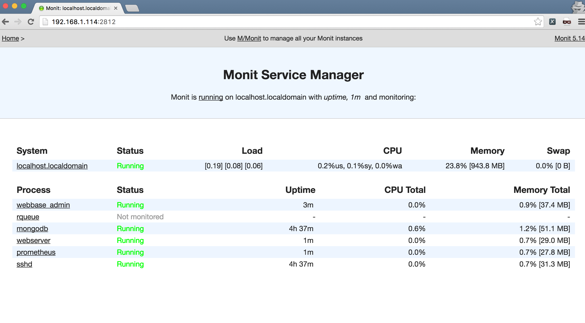

Webbase is a fully functionnal web application with a lot of features

# Webbase Front-End

# Webbase Admin

# Grafana

# Monit

# [Documentation](./documentation)

# Features

* Performance of asyncio
* Responsive design
* I18N

## App

* Registration
* Login / Logout
* Forgotten password
* Email confirmation
* Notification system

## Test

* Server-side unittests
* Client-side unittests
* Travis CI

## Security

* CSRF protection system
* XSS protection system
* Permission on model and model instance
* Route authorization

# Server

* Powerful CRUD

# Admin

* Flask-admin application for the models

## Build

* Build for dev, test and production using webpack
* HMR configured

## Queue

* Add a new job in the queue easily from the server

## Devs

* Configured logger for client-side and server-side

### Commands

* make new-route
* make new-model
* make stats
* make start-server
* make init-db-sample-data
* make test
* etc

## Monitoring

* Monitoring with prometheus and monit
* Notification on Slack

# Version

* 0.0.2 - 2016-10-14 - New features & bug fixes
* 0.0.1 - 2016-06-28 - Initial Release

# New in 0.0.2

- [x] Ansible deployment
- [x] Not supported browser system
- [x] Cookie Banner
- [x] Selenium test suite
- [x] DB migration system

# Coming up next

- [ ] Cookiecutter configuration
- [ ] EC2 deployment
- [ ] Os X deployment
- [ ] Documentation
- [ ] Amazon SES
- [ ] OpenID (twitter / facebook / google / github)

# License

* MIT

# Open-Source projects that webbase use:

* [React](https://github.com/facebook/react)
* [React-intl](https://github.com/yahoo/react-intl)
* [Redux](https://github.com/reactjs/redux)
* [React-router](https://github.com/reactjs/react-router)
* [Webpack](https://github.com/webpack/webpack)
* [Aoihttp](https://github.com/KeepSafe/aiohttp)
* [Prometheus](https://github.com/prometheus/prometheus)
* [Grafana](https://github.com/grafana/grafana)
* [Monit](https://bitbucket.org/tildeslash/monit)
* [Flask-admin](https://github.com/flask-admin/flask-admin)
* [MongoAlchemy](https://github.com/jeffjenkins/MongoAlchemy)
* [Cookiecutter](https://github.com/audreyr/cookiecutter)
* [Postcss](https://github.com/postcss/postcss)
* [Pytest](https://github.com/pytest-dev/pytest)
* [Enzyme](https://github.com/airbnb/enzyme)
* [Karma](https://github.com/karma-runner/karma)
* [Bootstrap](https://github.com/twbs/bootstrap)
* [rq](https://github.com/nvie/rq)
* [yarn](https://github.com/yarnpkg/yarn)
* ...

