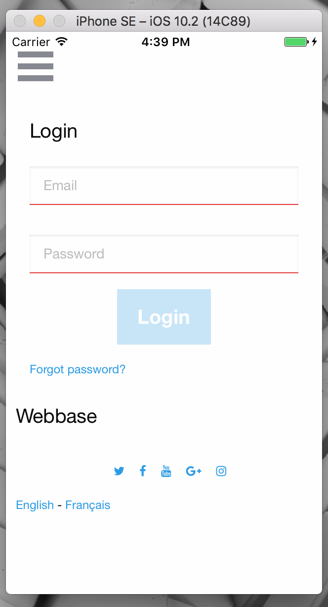

[](https://travis-ci.org/jf-parent/webbase)
[](https://www.python.org/downloads/release/python-350/)
[](https://opensource.org/licenses/MIT)

# Webbase Front-End


# Webbase Front-End Cordova ios

# Webbase Front-End Cordova android


# Webbase Front-End Electron osx


# Webbase Admin


# Monit


# Installation

```bash
$ pip install cookiecutter
$ cookiecutter .
```

# [Documentation](./{{cookiecutter.project_name}}/documentation)

# Version

* 0.0.4 - 2017-01-06 - New features & bug fixes
* 0.0.3 - 2016-12-28 - New features & bug fixes
* 0.0.2 - 2016-10-14 - New features & bug fixes
* 0.0.1 - 2016-06-28 - Initial Release

## [0.0.4] - 2017-01-06
### Added
- Electron
- Front-End Tests
- Ansible (env) (nginx)

### Removed
- Prometheus
- Bootstrap

# Coming up next

- [x] Electron
  - [ ] icons
  - [ ] menu
  - [ ] test linux
  - [ ] test windows
- [ ] Component Library
- [ ] Ansible
    - [ ] EC2 deployment
    - [ ] OsX deployment
    - [ ] OpenBSD deployment
- [ ] Documentation
- [ ] Amazon SES
- [ ] Sqlalchemy [postgresql / mysql]
- [ ] ReactNative?
- [ ] Netdata
- [ ] Load Testing
- [ ] Backend Webserver 
    - [ ] golang server
    - [ ] server-side rendering
- [ ] Webpack 2
- [ ] auth redis / mongod
- [ ] OpenID (twitter / facebook / google / github)

# License

* MIT

# Open-Source projects that webbase use:

* [React](https://github.com/facebook/react)
* [React-intl](https://github.com/yahoo/react-intl)
* [Redux](https://github.com/reactjs/redux)
* [React-router](https://github.com/reactjs/react-router)
* [Webpack](https://github.com/webpack/webpack)
* [Aoihttp](https://github.com/KeepSafe/aiohttp)
* [Monit](https://bitbucket.org/tildeslash/monit)
* [Flask-admin](https://github.com/flask-admin/flask-admin)
* [MongoAlchemy](https://github.com/jeffjenkins/MongoAlchemy)
* [Cookiecutter](https://github.com/audreyr/cookiecutter)
* [Pytest](https://github.com/pytest-dev/pytest)
* [Enzyme](https://github.com/airbnb/enzyme)
* [Karma](https://github.com/karma-runner/karma)
* [rq](https://github.com/nvie/rq)
* [yarn](https://github.com/yarnpkg/yarn)
* [cordova](https://cordova.apache.org/)
* [netdata](https://github.com/firehol/netdata)
